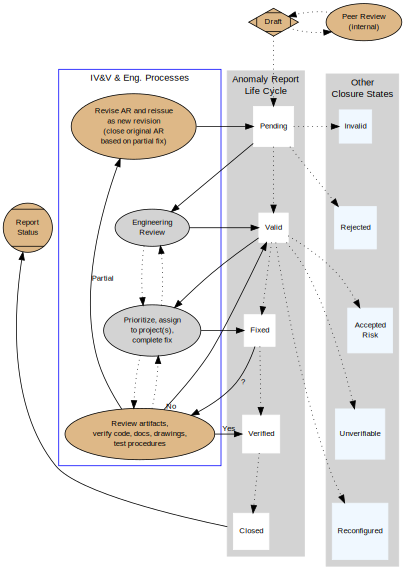

Appendix A
----------

Example of open source use in engineering; graphviz diagrams and IV&V.

Overall IV&V Engineering Process for Tracking Anomaly Reports
~~~~~~~~~~~~~~~~~~~~~~~~~~~~~~~~~~~~~~~~~~~~~~~~~~~~~~~~~~~~~

* Revise: Problem described in AR was partially fixed but needs additional work;
  a new revision of an AR has been written.
* Validate: Developer/customer validates ARs in the Pending state.
* Prioritize: Developer/customer prioritizes ARs and assign to project(s).
* Verify: IV&V verifies ARs declared fixed by the developer.  Partial fixes
  generate a revision of the original AR (the latter is closed based on the partial fix).
* Report: IV&V reports AR State changes and status of open ARs.

AR States and Status
~~~~~~~~~~~~~~~~~~~~

* Draft State: Anomaly Reports begin in a draft status for IV&V peer review;
  refined drafts may be circulated outside IV&V if warranted.

  * Draft Status: IV&V peer review of potential anomalies results in publication
    of draft AR.

* Open State: Open ARs begin with a status of "Pending" when an approved draft
  AR is published.  Engineering review leads to the next status change, typically
  "Valid".  Valid ARs are prioritized and assigned to an appropriate project;
  when engineering considers the problem fixed, the AR status is changed to
  "Fixed".  Fixed ARs are verified by IV&V, and their status changed to 
  "Verified" if the problem was fixed.  In the case of a "partial" fix,
  a the original AR is declared "Verified" and closed based on the fix,
  and a new revision of the AR is written to describe any remaining issues.

  * Pending Status: An original or revised AR is generated, entered in the
    database, and delivered to project distribution list.
  * Valid Status: Developer (or customer) validates that AR identifies an
    error or problem condition that must be fixed.
  * Fixed Status: Problem described in AR is considered fixed by developer
    but has not been verified by IV&V.
  * Verified Status: Problem has been fixed by developer and IV&V has
    verified the fix.

* Closed state: Typically closed ARs have the status "Verified" (verified
  by IV&V), however, there are several other potential status flags for
  closed ARs, depending on the circumstances (see below).

  * Invalid Status: AR is considered technically inaccurate and does
    not describe an error.
  * Rejected Status: AR is technically accurate but the problem will
    not be fixed due to non-technical reasons.
  * Accepted Risk Status: Cost/benefit ratio does not justify fixing
    the problem.
  * Unverifiable Status: Original problem cannot be recreated in order
    to verify fix, and there is no other recourse.
  * Reconfigured Status: System has changed such that the original problem
    no longer applies.

.. raw:: pdf

   PageBreak

   Anomaly Report And Tracking State Diagram

.. raw:: pdf

   PageBreak

The Dot source code for the graphviz diagram is included below.

.. include:: images/anomaly_state_diagram-2.dot
   :code:
   :literal:
   :number-lines:

