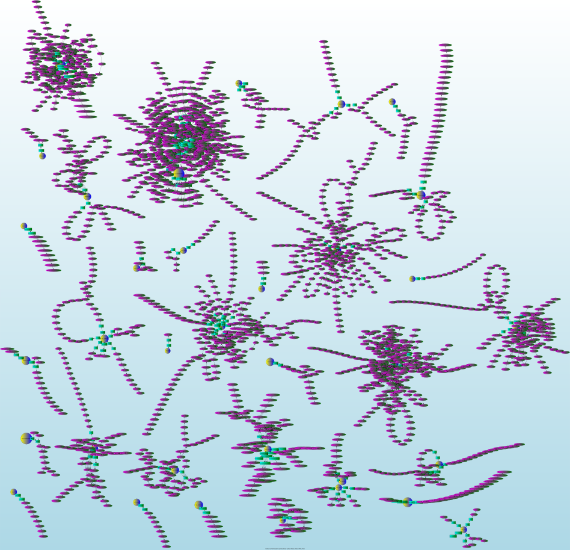

Appendix B
----------

Experiments in git commit graphs using Graphviz (approx. 10 years of data).

The full graphs are too large and/or not "compatible" enough to embed in a simple
document; the full size .svg graphs are hosted on `dev.gentoo.org`_.

.. _dev.gentoo.org: http://dev.gentoo.org/~nerdboy/

   Fig B. Category / Package Cluster Graph, Gentoo Linux commits by nerdboy, 2003 - 2013

