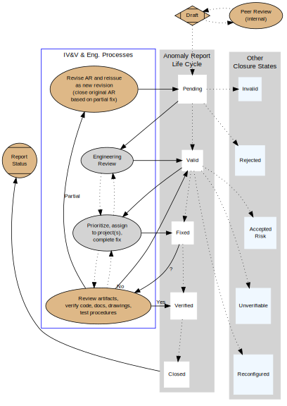

.. Process this file to a pdf using the command : "rst2pdf -s pdf-resume.style sarnold.rst"

==================
 Stephen L Arnold
==================

Systems Engineer/Architect and Applied Earth Scientist
======================================================
+--------------------------------------+-------------------------+-------------------+
|**Address**: USA (Santa Maria, CA)    |**Degrees**:  Geophysics |.. image:: id.jpg  |
|                                      |                         |   :scale: 22%     |
|**Phone**: +01 (805) 863-8299         |**Language**: English    |   :align: center  |
|                                      |                         |                   |
|**Email**: stephen.arnold42@gmail.com |                         |                   |
+--------------------------------------+-------------------------+-------------------+

Education
---------
:1995-Present: Graduate/short courses in Toxic Risk Assessment, C, Ada, Zope, 
  Doppler and Polarimetric Weather Radar, 595th TEG Test and Evaluation Course,
  AMS Faculty Workshop, AHC Professional Development courses.

:1990: MS Degree in Geophysics, San Diego State University.  Thesis topic: Atmospheric
  Resonance Waves Over the Sea of Cortés: An Experimental Case Study

:1986: BS Degree in Geophysics, San Diego State University.

Technical skills
----------------
:CS/SE: Strong knowledge of programming languages and tools, system performance,
  design, testing, and administration, as well as the software lifecycle,
  CI, software processes, requirements engineering, and system architecture,
  CyberSecurity
:Operating Systems: Unix/Linux/Embedded (Gentoo, OE, RHEL, Debian/Ubuntu),
  Android
:Project Management: Planner, OpenAdams, SCM tools, Make/Autotools, trac/git,
  doxygen, TaskWarrior
:DataBase: SQL, Postgres/spatial, sqlite, redis/nosql
:Software: Libre/Open office tools, docutils, graphviz, Dia, Inkscape
:Embedded Systems: Gentoo, OpenEmbedded, Android, design/build/deployment
  of applications for ARM and other embedded systems, Android, debian/Ubuntu

Languages
---------
:English: Native
:Spanish: Conversational(-ish)
:Applied Math: Fluent
:Programming: Python, Ada, Bash/POSIX Shell, C, Java, C++, Perl, js, AWK, FORTRAN
:Markup: reStructuredText, HTML, DTML, XML, Markdown
:Architectures: x86/x86_64, ARM/AVR, Sparc, PowerPC, MIPS
:Engineering: IV&V, OOD/P, UML, DoDAF, 2167/498/12227, toolchains/SDKs, CI/Agile,
  jenkins/apache/trac/svn/git workflows, open document production

Recent Work Experience
----------------------

:2014 - Present: Startup Mentor and Tech Adviser - Technology and Open Source
  adviser, `Santa Maria Startup Weekend`_ and local startup meetups.  Open source
  presentations, technology training, demos.

:2014 - Present: Principal Scientist, Systems Architect, Business Development -
  `VCTLabs, Inc`_ - Goleta, CA.  VCT Product/Project management, conferences/expos,
  open source outreach & education. IV&V, Range Meteorology, and Hazard/Risk Modeling
  Subject Matter Expert (SME), education & training instructor.  Systems Architecture
  and CyberSecurity (specializing in Gentoo, OpenEmbedded, RHEL, and Debian/Ubuntu,
  Linux development, build, and deployment testing.  Linux kernel/u-boot and software
  testing on various ARM devices (Gentoo Linux, OE).  Business/community development
  (event support, outreach, presentations, proposals).

:2011 - 2014: SynergyHD3  - Senior Software Engineer -
  `Arthrex California Technology, Inc.`_ - Goleta, CA. DevOps, software/systems
  engineering, CM/QA, test & integration. Agile infrastructure & CI process
  implementation, Jenkins build/test/deployment automation. Linux OS/Distribution
  engineering, software and manufacturing process validation.

:2009 - 2011: Staff Scientist, IV&V / Systems Engineering and Architecture Support -
  `ENSCO, Inc.`_ - VAFB, CA.  Subject Matter Expert – Range Meteorological Systems,
  Flight Safety, Instrumentation. Launch Range Enterprise Architecture analysis
  (supersystem, subsystem, product). Safety-critical systems IV&V (Flight Termination,
  Range Timing). Range Architecture Model VV&A, model evaluation, code analysis,
  and test engineering. Software process, internal SCM and IV&V tool engineering.

:2006 - 2009: Staff Scientist, System Performance Evaluation and Validation - 
  `ENSCO, Inc.`_ - VAFB, CA. Performance analysis and verification & validation of
  Weather, Flight Operations, TEMS/Timing and Infrastructure products for new
  Mission Flight Control Center. Responsible for Weather, Infrastructure, and
  Data Handling subsystems; technical IA and System Security/Accreditation support.

:2002 - 2006: Senior Scientist, `Meteorological And Range Safety System`_ (MARSS),
  Instrumentation and Infrastructure - `ENSCO, Inc.`_ - Santa Maria &  VAFB, CA.
  RSA-MARSS and INF system design and requirements engineering, user training.
  Model evaluation and localization, integration with MM5/AWIPS, range
  instrumentation integration and test support.

:1999 - 2009: Associate Faculty, Dept of Geography - Allan Hancock College,
  Santa Maria, CA.  Senior instructor for physical geography and meteorology
  courses (also taught Human Geography). Curriculum review, course development,
  technology insertion, conference presentations.

:1997 - 2002: Senior Scientist - Independent Verification & Validation -
  `ENSCO, Inc.`_ - VAFB, CA. IV&V of Launch & Test Range Meteorological and
  Flight Safety Systems, Range engineering and test support to AFOTEC and 17th
  Test Squadron. 

:1991 - 1997: Senior Systems Engineer, IV&V Task Lead on Meteorological Range 
  Safety Systems - Geodynamics Corp - VAFB, CA. Requirements/code analysis,
  windfield, dispersion, & `hazard model evaluation`_, algorithm & performance
  analysis, instrumentation and data quality analysis.

:1990 - 1991: Applied earth science & software consultant, San Diego, CA.
  Air toxics risk assessment modeling studies, sensitivity studies, environmental
  assessments, cost-benefit analyses, bug-fixes and model enhancements (IWG Corp),
  geophysical data acquisition (JR & Assoc), database design/implementation
  (SDSU Instructional Media Center).

.. _Santa Maria Startup Weekend: http://santamaria.startupweekend.org/
.. _VCTLabs, Inc: http://www.vctlabs.com
.. _Arthrex California Technology, Inc.: http://www.arthrex.com
.. _ENSCO, Inc.: http://www.ensco.com
.. _Meteorological And Range Safety System: https://www.researchgate.net/publication/270616408_P22_The_Meteorological_And_Range_Safety_Support_MARSS_system_a_GIS-based_tool_for_launch_area_hazard_prediction_and_visualization?ev=prf_pub
.. _hazard model evaluation: https://www.researchgate.net/publication/294263780_Physical_Thermodynamic_Properties_of_Hypergolic_Propellants_A_Review_and_Update

Recent FOSS Experience
----------------------

:2015 - Present: Co-maintainer of imx233-olinuxino boards for the `FSL Community BSP`_
  (tested with Yocto/OpenEmbedded and meta-fsl*).

:2014 - Present: Founding member `Central Coast Open Source Solutions Exchange`_,
  an open source technology-focused meetup.

:2012 - Present: Contributing developer - OpenEmbedded_ and Yocto_.

:2003 - Present: Senior Developer - `Gentoo Linux`_.  Maintainer of developer
  tools, GIS/scientific libraries, mentor of new developers, currently primary
  maintainer of `Gentoo ARM overlay`_ and my own `dev overlay`_.

:2000 - Present: Upstream developer and/or maintainer of several tools and
  utility libraries for source code metrics, graphics, science, and education.
  See the `maintenance release page`_ and the individual github project sites
  for more information.

.. _FSL Community BSP: http://freescale.github.io/doc/release-notes/1.8/
.. _Central Coast Open Source Solutions Exchange: http://www.meetup.com/Central-Coast-Open-Source-Solutions-Exchange/
.. _OpenEmbedded: http://www.openembedded.org/
.. _Yocto: https://www.yoctoproject.org
.. _Gentoo Linux: https://www.gentoo.org/
.. _Gentoo ARM overlay: https://github.com/gentoo/arm
.. _dev overlay: https://github.com/sarnold/portage-overlay
.. _maintenance release page: http://www.gentoogeek.org

Recent Education Experience
---------------------------

:1999 - 2009: Associate Faculty - `Allan Hancock College`_ (senior geography
  and meteorology instructor). Taught Physical and Human Geography courses
  and ocassional technology courses, updated official geography course
  outlines, created new introductory meteorology course.

.. _Allan Hancock College: http://www.hancockcollege.edu

:2014 - Present: Volunteer Instructor/Mentor - Google Summer of Code, 
  Computer Science Education Week, and Open Document Foundation's
  Document Freedom Day.

  * `GSoC mentor for BeagleBoard.Org`_: BeagleSat project.
  * `Computer Science Education Week`_: Python Intro to CS course.
  * `ODF`_ contributor, `Document Freedom Day`_: Open Document Workshop.

.. _GSoC mentor for BeagleBoard.Org: http://elinux.org/BeagleBoard/GSoC/2015_Projects
.. _Computer Science Education Week: https://csedweek.org/
.. _Document Freedom Day: https://documentfreedom.org/
.. _ODF: http://www.opendocumentformat.org/

Selected Projects
-----------------

  * Maintainer of `GNU Winds On Critical Streamline Surfaces (GWOCSS)`_
    diagnostic windfield model.
  * Senior Developer, `Gentoo Linux`_. Maintainer of `gentoo-embedded arm overlay`_,
    developer tools, gnat-gcc, other.
  * Project lead, `Open Source Weather Station`_ - Raspberry Pi weather sensors
    and display software, arduino lightning detector (AMS WeatherFest demo).
  * Embedded OS build, test, deployment, validation. SynergyHD3 embedded surgical
    camera project, Arthrex California Technology.
  * Lead Systems Engineer, Subject Matter Expert for Meteorological And Range
    Safety System (MARSS), VAFB.  Model evaluation and localization, integration
    with MM5/AWIPS and local instrumentation, forecaster/maintainer training.
  * Test Director, test tool development, and scientific & engineering support,
    RSA Weather and Range Safety Systems, AFOTEC and 17TS.
  * IV&V of MARSS, REEDM, and meteorological data systems, 30th Space Wing, VAFB.
  * Volunteer user group leader, technical support, and PoP maintenance, RAIN
    (non-profit ISP).
  * Maintenance Development and Modeler, Air Emissions Risk Assessment Model
    (AERAM). Air toxics risk assessment modeling, sensitivity studies, control
    trade-offs. Added "batch" mode for large model runs, fixed bugs.
  * Research Assistant, Data Analyst, Scientific Programmer on `Marginal Seas
    Experiment`_, 1984/85.
  * Research Assistant, `Gibraltar Experiment`_, 1986.
  * Research Assistant, `Shelf MIxed-Layer Experiment (SMILE)`_, 1989.

.. _GNU Winds On Critical Streamline Surfaces (GWOCSS): http://sarnold.github.io/gwocss/
.. _Gentoo Linux: https://www.gentoo.org/
.. _gentoo-embedded arm overlay: https://github.com/gentoo/arm
.. _Open Source Weather Station: https://github.com/VCTLabs/weather-rpi
.. _Marginal Seas Experiment: http://scrippsscholars.ucsd.edu/cdorman/content/lower-atmosphere-over-gulf-california
.. _Gibraltar Experiment: https://www.researchgate.net/publication/230228131_Winds_in_the_Strait_of_Gbraltar
.. _Shelf MIxed-Layer Experiment (SMILE): http://journals.ametsoc.org/doi/abs/10.1175/1520-0493%281995%29123%3C2384%3ASOTLAO%3E2.0.CO%3B2

Selected Publications
---------------------

.. line-block::

  **Open Data Standards and Open Source Modeling Tools: The GPL'd Release of Winds**
      **On Critical Streamline Surfaces (GWOCSS)** (2015) S. L. Arnold, presented at
      the 31st Conference on Environmental Information Processing Technologies,
      Open Data Standards and Sharing track (95th Annual AMS Meeting, 2015).

  **Incorporating the AMS Online Weather Studies Resources In the Design**
      **of a New Meteorology Course** (2007) S. L. Arnold, presented at the
      Educational Initiatives Poster Session, 17th Symposium on Education
      (88th Annual AMS Meeting, 2008).

  **Open Source Technologies in Science Education: What's Your Geek IQ?** (2004)
      S. L. Arnold, presented at the Joint Session on Cyberinfrastructure to
      Support Atmospheric and Oceanic Education: Examples and Strategies, 14th
      Symopsium on Education (85th Annual AMS Meeting, 2005)

  **The Meteorological And Range Safety Support (MARSS) System: a GIS-based**
      **Tool for Launch Area Hazard Prediction and Visualization** (2004)
      S. L. Arnold, A. Dianic, and E. Magnuson, presented at the 21st Int Conf
      on Interactive Information Processing Systems (IIPS) for Meteorology,
      Oceanography, and Hydrology (85th Annual AMS Meeting, 2005)

  **An Operational System for Real-time Lightning Display and Resource Protection**
      (2004) E. Magnuson, S. L. Arnold, and A. Dianic, presented at the Conference on
      Meteorological Applications of Lightning Data (85th Annual AMS Meeting, 2005)

  **A Minimum Variance Approach to Estimating Wind Direction Statistics** (2001)
      S. L. Arnold, presented at the 18th Int Conf on Interactive Information
      Processing Systems (IIPS) for Meteorology, Oceanography, and Hydrology
      (82nd Annual AMS Meeting, 2002)

  **Physical & Thermodynamic Properties of Hypergolic Propellants: A Review**
      **and Update.** (1999) S. L. Arnold, Presented at the 1999 JANNAF
      Inter-agency Propulsion Committee PD&CS and S&EPS  Joint Meeting,
      San Diego, CA

Professional
------------

:Affiliations: American Meteorological Society,
               American Geophysical Union,
               Assoc. for Computing Machinery,
               Computer Science Teachers Assoc,
               American Federation of Teachers

:Interests: Earth Science Education,
            Computer Literacy/Fluency,
            Privacy and Security,
            Linux and Open Source,
            Environmental Risks and Hazards,
            Space Exploration and Technology

Personal
--------
:Home sites: http://www.gentoogeek.org  and  https://www.linkedin.com/pub/steve-arnold/3/172/427
:Repositories: https://github.com/sarnold  and  https://github.com/VCTLabs
:Publications: http://www.researchgate.net/profile/Stephen_Arnold4
:Interests: Guitar/Bass/Pecussion, Science Fiction, Open Source

.. raw:: pdf

   PageBreak

Appendix A
----------

Example of open source use in engineering; graphviz diagrams and IV&V.

Overall IV&V and Engineering Processes
~~~~~~~~~~~~~~~~~~~~~~~~~~~~~~~~~~~~~~

* Revise: Problem described in AR was partially fixed but needs additional work;
  a new revision of an AR has been written.
* Validate: Developer/customer validates ARs in the Pending state.
* Prioritize: Developer/customer prioritizes ARs and assign to project(s).
* Verify: IV&V verifies ARs declared fixed by the developer.  Partial fixes
  generate a revision of the original AR (the latter is closed based on the partial fix).
* Report: IV&V reports AR State changes and status of open ARs.

AR States and Status
~~~~~~~~~~~~~~~~~~~~

* Draft State: Anomaly Reports begin in a draft status for IV&V peer review;
  refined drafts may be circulated outside IV&V if warranted.

  * Draft Status: IV&V peer review of potential anomalies results in publication
    of draft AR.

* Open State: Open ARs begin with a status of "Pending" when an approved draft
  AR is published.  Engineering review leads to the next status change, typically
  "Valid".  Valid ARs are prioritized and assigned to an appropriate project;
  when engineering considers the problem fixed, the AR status is changed to
  "Fixed".  Fixed ARs are verified by IV&V, and their status changed to 
  "Verified" if the problem was fixed.  In the case of a "partial" fix,
  a the original AR is declared "Verified" and closed based on the fix,
  and a new revision of the AR is written to describe any remaining issues.

  * Pending Status: An original or revised AR is generated, entered in the
    database, and delivered to project distribution list.
  * Valid Status: Developer (or customer) validates that AR identifies an
    error or problem condition that must be fixed.
  * Fixed Status: Problem described in AR is considered fixed by developer
    but has not been verified by IV&V.
  * Verified Status: Problem has been fixed by developer and IV&V has
    verified the fix.

* Closed state: Typically closed ARs have the status "Verified" (verified
  by IV&V), however, there are several other potential status flags for
  closed ARs, depending on the circumstances (see below).

  * Invalid Status: AR is considered technically inaccurate and does
    not describe an error.
  * Rejected Status: AR is technically accurate but the problem will
    not be fixed due to non-technical reasons.
  * Accepted Risk Status: Cost/benefit ratio does not justify fixing
    the problem.
  * Unverifiable Status: Original problem cannot be recreated in order
    to verify fix, and there is no other recourse.
  * Reconfigured Status: System has changed such that the original problem
    no longer applies.

.. raw:: pdf

   PageBreak

   Anomaly Report And Tracking State Diagram

.. raw:: pdf

   PageBreak

The Dot source code for the graphviz diagram is included below.

.. include:: images/anomaly_state_diagram.dot
   :code:
   :literal:
   :number-lines:

